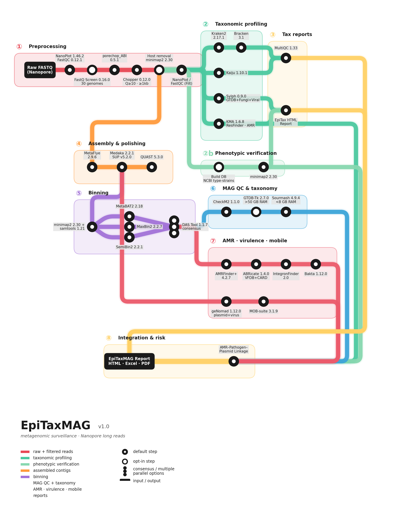

# EpiTaxMAG

Nextflow pipeline for Nanopore metagenomics: taxonomic profiling, MAG recovery, AMR-pathogen-plasmid linkage, and epidemiological risk assessment.

Developed by **FISABIO — EPIMOL** (Molecular Epidemiology), Valencia, Spain.

<p align="center">
  
</p>

---

## Overview

EpiTaxMAG processes Oxford Nanopore long reads from raw FASTQ to interactive epidemiological surveillance reports. Two phases:

- **EpiTax** (TAX phase): QC, adapter trimming, quality filtering, multi-tool taxonomic profiling (Kraken2, Bracken, Kaiju, Sylph), read-level AMR screening (KMA/ResFinder), and interactive HTML report.

- **EpiTaxMAG** (MAG phase): Metagenomic assembly (MetaFlye + Medaka), multi-algorithm binning (MetaBAT2 + MaxBin2 + SemiBin2 + DAS Tool), quality assessment (CheckM2), MAG taxonomy (GTDB-Tk or Sourmash), AMR and virulence detection (AMRFinderPlus, ABRicate/VFDB), plasmid characterization (geNomad, MOB-suite), integron detection (IntegronFinder), functional annotation (Bakta), and comprehensive HTML/Excel reports with AMR-pathogen-plasmid risk assessment.

---

## Quick Start

```bash
# Clone and run (databases download automatically on first run)
git clone https://github.com/asanzcarb/epitaxmag.git
cd epitaxmag
nextflow run main.nf --input /path/to/fastqs -profile gru
```

---

## Installation & Local Configuration

### 1. Requirements

- **Nextflow** >= 23.04 ([install](https://www.nextflow.io/docs/latest/install.html))
- **Conda/Mamba** or **Singularity/Apptainer**
- **Disk space**: ~170 GB (TAX only) or ~360 GB (TAX + MAG) for databases
- **RAM**:
  - High-memory server (>= 200 GB): Full pipeline with GTDB-Tk
  - Medium server (64 GB): Use `--skip_gtdbtk` (Sourmash as lightweight alternative)
  - Desktop (56 GB): Use `--skip_gtdbtk`

### 2. Clone the repository

```bash
cd /home/user/projects
git clone https://github.com/asanzcarb/epitaxmag.git
cd epitaxmag
```

### 3. Create your local configuration

The file `conf/local.config` contains server-specific settings (database paths, proxy, Singularity bind mounts). It is **not tracked by git** — each user creates their own from the template:

```bash
cp conf/local.config.example conf/local.config
nano conf/local.config
```

**What to edit in `conf/local.config`:**

| Parameter | Description | Example |
|-----------|-------------|---------|
| `params.db_root` | Root directory for all databases. The pipeline downloads them here automatically on first run (~360 GB). | `"/data/databases"` |
| `params.fastqscreen_conf` | Path to FastQ Screen config (auto-generated if not set). | Leave default |
| `params.epitaxmag_tools_sif` | Path to custom Singularity image (only if using `-profile singularity`). | `"${projectDir}/containers/epitaxmag-tools-1.0.0.sif"` |
| `params.singularity_bind` | Extra bind paths for Singularity containers (directories outside `$HOME`). | `"--bind /data --bind /scratch"` |
| `env.http_proxy` | HTTP proxy (if your network requires it). | `"http://proxy.example.com:8080"` |

**Minimal `conf/local.config` example:**

```groovy
// Just set the database path — everything else has sensible defaults
params.db_root = "/data/databases"
```

### 4. First run (downloads databases automatically)

On the first execution, the pipeline will download all required databases to `params.db_root`. This takes 1-3 hours depending on bandwidth. Subsequent runs reuse the cached databases.

```bash
# TAX only (taxonomic profiling)
nextflow run main.nf --input /path/to/fastqs -profile gru

# TAX + MAG (full pipeline)
nextflow run main.nf --input /path/to/fastqs --run_assembly -profile gru
```

If databases are already downloaded, skip the setup:
```bash
nextflow run main.nf --input /path/to/fastqs --skip_db_setup -profile gru
```

---

## Running the Pipeline

### Option A: From local clone (recommended for development)

```bash
cd /path/to/epitaxmag

nextflow run main.nf \
    --input /path/to/fastqs \
    --run_assembly \
    -profile gru
```

### Option B: Directly from GitHub (no clone needed)

```bash
nextflow run asanzcarb/epitaxmag \
    --input /path/to/fastqs \
    --db_root /path/to/databases \
    --run_assembly \
    -profile censalud
```

Nextflow downloads the pipeline from GitHub automatically.

### Option C: Low-memory server (< 64 GB RAM)

Use `--skip_gtdbtk` to replace GTDB-Tk (~120 GB RAM) with Sourmash (~5 GB RAM):

```bash
nextflow run main.nf \
    --input /path/to/fastqs \
    --run_assembly \
    --skip_gtdbtk \
    -profile censalud
```

### Show all available options

```bash
nextflow run main.nf --help
```

---

## Hardware Profiles

| Profile | CPUs | RAM | Kraken2 mode | Notes |
|---------|------|-----|-------------|-------|
| `gru` | 48 | 240 GB | DB in RAM | Full pipeline incl. GTDB-Tk |
| `censalud` | 24 | 58 GB | memory-mapping (NVMe) | Use `--skip_gtdbtk` |
| `pc` | 20 | 52 GB | memory-mapping | Use `--skip_gtdbtk` |
| `singularity` | - | - | - | Combine: `-profile gru,singularity` |

---

## Pipeline Steps (35 total)

### TAX Phase (steps 01-13)
| Step | Tool | Function |
|------|------|----------|
| 01 | NanoPlot + FastQC | Raw read QC |
| 02 | FastQ Screen | Contamination screening (30-genome panel) |
| 03 | Porechop ABI | Adapter trimming |
| 04 | Chopper | Quality/length filtering (Q>=10, len>=1000bp) |
| 05 | minimap2 | Host removal (optional, `--host_genome`) |
| 06 | NanoPlot + FastQC | Filtered read QC |
| 07 | Kraken2 | k-mer taxonomic classification |
| 08 | Bracken | Abundance estimation |
| 09 | Kaiju | Protein-based classification |
| 10 | Sylph | ANI-based profiling (GTDB + fungi + viral) |
| 11 | KMA | Read-level AMR screening (ResFinder) |
| 12 | MultiQC | Integrated QC report |
| 13 | Python/Plotly | Interactive HTML report (EpiTax) |

### MAG Phase (steps 14-31)
| Step | Tool | Function |
|------|------|----------|
| 14 | MetaFlye | Metagenomic assembly |
| 15 | Medaka | Assembly polishing (SUP v5.2.0 model) |
| 16 | QUAST | Assembly statistics |
| 17 | minimap2 | Coverage mapping |
| 18 | MetaBAT2 | Binning (composition + coverage) |
| 19 | MaxBin2 | Binning (expectation-maximization) |
| 20 | SemiBin2 | Binning (deep learning, long reads) |
| 21 | DAS Tool | Bin refinement (consensus of 3 binners) |
| 22 | CheckM2 | MAG quality (completeness, contamination) |
| 23 | GTDB-Tk / Sourmash | MAG taxonomy (GTDB r232 / RS226) |
| 24 | AMRFinderPlus | AMR + virulence + stress in MAGs |
| 25 | geNomad | Plasmid and virus detection |
| 26 | Python | AMR-pathogen-plasmid integration |
| 27 | ABRicate | Virulence (VFDB) + AMR (CARD) + PlasmidFinder |
| 28 | MOB-suite | Plasmid typing (replicons, mobility, host range) |
| 29 | IntegronFinder | Class 1/2/3 integron detection |
| 30 | Bakta | Functional annotation (tRNA, rRNA, CDS, CRISPR) |
| 31 | Python/Plotly | Interactive HTML + Excel report (EpiTaxMAG) |

---

## Databases

Downloaded automatically on first run (~360 GB total):

| Database | Size | Tool | Phase |
|----------|------|------|-------|
| Kraken2 PlusPF | ~100 GB | Kraken2/Bracken | TAX |
| Kaiju RefSeq | ~34 GB | Kaiju | TAX |
| Sylph GTDB+Fungi+Viral | ~17 GB | Sylph | TAX |
| ResFinder | ~3 MB | KMA | TAX |
| FastQ Screen panel | ~7 GB | FastQ Screen | TAX ([Zenodo](https://zenodo.org/records/19860716)) |
| GTDB-Tk r232 | ~100 GB | GTDB-Tk | MAG |
| Sourmash GTDB RS226 | ~3.7 GB | Sourmash | MAG (alternative) |
| CheckM2 | ~3 GB | CheckM2 | MAG |
| geNomad | ~1.4 GB | geNomad | MAG |
| Bakta | ~84 GB (full) / ~4 GB (light) | Bakta | MAG |
| AMRFinderPlus | ~238 MB | AMRFinderPlus | MAG |

---

## Reports

```
results/<run>/32_reports/
├── <run>_epitaxmag_report.html     # Interactive HTML (16 sections, Plotly)
├── <run>_full_report.xlsx          # Comprehensive Excel (16+ sheets)
├── <run>_report.pdf                # Professional PDF
├── <run>_amr_pathogen_matrix.tsv   # TSV for external analysis
├── screening_charts.html           # FastQ Screen + Early Warning
└── per_sample/                     # Individual per-sample HTML reports
```

### HTML Report Sections
1. Pipeline DAG (workflow with software versions)
2. Run statistics (% unclassified reads)
3. Read retention (raw vs clean)
4. Screening (FastQ Screen + Sylph Early Warning for target organisms)
5. Per-sample summary
6. Assembly and binning metrics
7. MAG catalog (taxonomy + quality + annotation)
8. Taxonomic composition
9. AMR detail (with NCBI + CARD links, confidence scores)
10. AMR heatmap (organisms x resistance classes)
11. KMA reads vs MAG contigs concordance
12. Virulence factors (VFDB)
13. Plasmids (geNomad)
14. Integrons (IntegronFinder)
15. Risk assessment
16. Software versions

---

## Project Structure

```
epitaxmag/
├── main.nf                     # Entry point
├── nextflow.config             # Global configuration
├── conf/
│   ├── local.config            # Local server config (not in git)
│   └── local.config.example    # Template for new users
├── workflow/
│   ├── setup_db.nf             # Automatic database download
│   ├── tax/main.nf             # TAX subworkflow (17 processes)
│   └── mag/main.nf             # MAG subworkflow (18 processes)
├── envs/                       # Conda environment definitions (19 files)
├── scripts/                    # Python scripts (QC, reports, integration)
├── containers/                 # Dockerfile + Singularity def for custom image
├── branding/                   # Logo + org.info for branded reports
├── bin/                        # Auxiliary scripts
└── docs/                       # Documentation
```

---

## Key Parameters

| Parameter | Default | Description |
|-----------|---------|-------------|
| `--input` | required | Directory with .fastq.gz files |
| `--run_tax` | `true` | Run TAX phase |
| `--run_assembly` | `false` | Run MAG phase |
| `--db_root` | `databases/` | Root directory for all databases |
| `--skip_gtdbtk` | `false` | Use Sourmash instead of GTDB-Tk (saves RAM) |
| `--skip_db_setup` | `false` | Skip automatic database download |
| `--host_genome` | `null` | Host genome FASTA for decontamination |
| `--min_quality` | `10` | Minimum Chopper quality score |
| `--min_length` | `1000` | Minimum read length (bp) |
| `--bakta_db_type` | `full` | Bakta DB: `full` (84 GB) or `light` (4 GB) |

Run `nextflow run main.nf --help` for the complete list.

---

## Citation

If you use EpiTaxMAG, please cite the individual tools according to their original publications. See `docs/epitaxmag_methodology.md` for detailed references.

---

## Author

**Alejandro Sanz Carbonell**
Bioinformatics Researcher
FISABIO — EPIMOL (Molecular Epidemiology)
Avda. Catalunya 21, 46020 Valencia, Spain
alejandro.sanz@fisabio.es

## License

This project is licensed under the [GPL-3.0 License](LICENSE).

## Contact

For questions, bug reports, or feature requests, please open an [issue](https://github.com/asanzcarb/epitaxmag/issues) or contact alejandro.sanz@fisabio.es.
