# EpiTaxMAG Pipeline DAG

Copy the Mermaid code below into [mermaid.live](https://mermaid.live) to render and export as PNG/SVG/PDF, or view directly on GitHub.

```mermaid
%%{init: {'theme': 'base', 'themeVariables': { 'primaryColor': '#2C5F8A', 'primaryTextColor': '#fff', 'primaryBorderColor': '#1a3f5c', 'lineColor': '#5B9ABF', 'fontSize': '13px', 'fontFamily': 'arial'}}}%%

flowchart TB
    INPUT(["📁 Raw FASTQ<br/>Nanopore long reads"]):::input

    %% ═══ ① PREPROCESSING ═══
    subgraph PREPROCESS["<b>① PREPROCESSING</b>"]
        direction LR
        QC_RAW["NanoPlot 1.46.2<br/>FastQC 0.12.1<br/>CHECK_SQCORE"]:::pp
        FQS["FastQ Screen 0.16.0<br/>30-genome panel"]:::pp
        PORECHOP["Porechop ABI 0.5.1<br/>adapter trimming"]:::pp
        CHOPPER["Chopper 0.12.0<br/>Q≥10 · len≥1000bp"]:::pp
        HOST["Host Removal<br/>minimap2 2.30<br/>optional"]:::pp
        QC_FILT["NanoPlot + FastQC<br/>CHECK_SQCORE"]:::pp
        PORECHOP --> CHOPPER --> HOST --> QC_FILT
    end
    INPUT --> QC_RAW & FQS & PORECHOP

    %% ═══ ② TAXONOMIC PROFILING ═══
    subgraph TAX["<b>② TAXONOMIC PROFILING (read‑based)</b>"]
        direction LR
        KRAKEN["Kraken2 2.17.1<br/>k-mer classification"]:::tax
        BRACKEN["Bracken 3.1<br/>abundance estimation"]:::tax
        KAIJU["Kaiju 1.10.1<br/>protein classification"]:::tax
        SYLPH["Sylph 0.9.0<br/>ANI · GTDB+Fungi+Viral"]:::tax
        KMA["KMA 1.6.8<br/>AMR · ResFinder DB"]:::tax
        KRAKEN --> BRACKEN
    end
    HOST --> KRAKEN & KAIJU & SYLPH & KMA

    %% ═══ ②b PHENOTYPIC VERIFICATION ═══
    subgraph PHENO["<b>②b PHENOTYPIC VERIFICATION</b>"]
        direction LR
        PHENO_DB["Build DB<br/>NCBI type-strains<br/>target_organisms.tsv"]:::tax
        PHENO_MM2["minimap2 2.30<br/>breadth ≥1x/10x/30x"]:::tax
        PHENO_DB --> PHENO_MM2
    end
    HOST --> PHENO_MM2

    %% ═══ ③ TAX REPORTS ═══
    subgraph TAX_REPORT["<b>③ TAX REPORTS</b>"]
        direction LR
        MULTIQC["MultiQC 1.33"]:::report
        EPITAX_HTML["EpiTax Report<br/>interactive HTML<br/>9 sections"]:::report
    end
    BRACKEN & KAIJU --> MULTIQC
    SYLPH & KMA & PHENO_MM2 --> EPITAX_HTML

    %% ═══ ④ ASSEMBLY ═══
    subgraph ASSEMBLY["<b>④ ASSEMBLY &amp; POLISHING</b>"]
        direction LR
        FLYE["MetaFlye 2.9.6<br/>metagenomic assembly"]:::asm
        MEDAKA["Medaka 2.2.1<br/>polishing · SUP v5.2.0"]:::asm
        QUAST["QUAST 5.3.0<br/>assembly statistics"]:::asm
        FLYE --> MEDAKA --> QUAST
    end
    HOST --> FLYE

    %% ═══ ⑤ BINNING ═══
    subgraph BINNING["<b>⑤ BINNING</b>"]
        direction TB
        COVERAGE["minimap2 2.30 + samtools 1.21<br/>coverage mapping"]:::bin
        subgraph BINNERS[" "]
            direction LR
            METABAT["MetaBAT2 2.18<br/>composition + coverage"]:::bin
            MAXBIN["MaxBin2 2.2.7<br/>expectation-maximization"]:::bin
            SEMIBIN["SemiBin2 2.2.1<br/>deep learning · long reads"]:::bin
        end
        DASTOOL["DAS Tool 1.1.7<br/>bin refinement · consensus of 3"]:::bin
        COVERAGE --> METABAT & SEMIBIN
        METABAT & MAXBIN & SEMIBIN --> DASTOOL
    end
    MEDAKA --> COVERAGE
    MEDAKA --> MAXBIN

    %% ═══ ⑥ MAG QC & TAXONOMY ═══
    subgraph MAG_QC["<b>⑥ MAG QUALITY &amp; TAXONOMY</b>"]
        direction LR
        CHECKM2["CheckM2 1.1.0<br/>completeness & contamination"]:::mqc
        GTDBTK["GTDB-Tk 2.7.0<br/>GTDB r232<br/>⚠ >50 GB RAM"]:::mqc
        SOURMASH["Sourmash 4.9.4<br/>GTDB RS226<br/>✓ <8 GB RAM"]:::mqc
    end
    DASTOOL --> CHECKM2
    DASTOOL -->|"--skip_gtdbtk=false"| GTDBTK
    DASTOOL -->|"--skip_gtdbtk=true"| SOURMASH

    %% ═══ ⑦ FUNCTIONAL ═══
    subgraph FUNCTIONAL["<b>⑦ AMR · VIRULENCE · MOBILE&nbsp;ELEMENTS</b>"]
        direction LR
        AMRFINDER["AMRFinderPlus 4.2.7<br/>AMR + virulence + stress"]:::fn
        ABRICATE["ABRicate 1.4.0<br/>VFDB + CARD + PlasmidFinder"]:::fn
        GENOMAD["geNomad 1.12.0<br/>plasmid & virus detection"]:::fn
        MOBSUITE["MOB-suite 3.1.9<br/>plasmid typing"]:::fn
        INTFINDER["IntegronFinder 2.0<br/>class 1/2/3 integrons"]:::fn
        BAKTA["Bakta 1.12.0<br/>CDS · tRNA · rRNA · CRISPR"]:::fn
    end
    DASTOOL --> AMRFINDER & ABRICATE & INTFINDER & BAKTA
    MEDAKA --> GENOMAD & MOBSUITE

    %% ═══ ⑧ INTEGRATION ═══
    subgraph INTEGRATION["<b>⑧ INTEGRATION &amp; RISK&nbsp;ASSESSMENT</b>"]
        direction LR
        LINK["AMR–Pathogen–Plasmid Linkage<br/>Python integration"]:::int
        REPORT["EpiTaxMAG Report<br/>HTML · Excel · PDF"]:::int
        LINK --> REPORT
    end
    CHECKM2 & GTDBTK & SOURMASH --> LINK
    AMRFINDER & ABRICATE & GENOMAD & MOBSUITE & INTFINDER & BAKTA --> LINK
    KMA --> LINK

    %% ═══ OUTPUT ═══
    OUTPUT(["📊 Final Reports<br/>HTML · Excel · PDF<br/>Per-sample + General"]):::output
    REPORT --> OUTPUT
    EPITAX_HTML --> OUTPUT
    MULTIQC --> OUTPUT

    %% ═══ STYLING ═══
    classDef input fill:#1a3f5c,stroke:#0d2137,color:#fff,stroke-width:2px
    classDef pp fill:#5B9ABF,stroke:#2C5F8A,color:#fff,stroke-width:1px
    classDef tax fill:#28A745,stroke:#1e7e34,color:#fff,stroke-width:1px
    classDef report fill:#1ABC9C,stroke:#148f77,color:#fff,stroke-width:1px
    classDef asm fill:#E05C2A,stroke:#b34420,color:#fff,stroke-width:1px
    classDef bin fill:#9B59B6,stroke:#7d3c98,color:#fff,stroke-width:1px
    classDef mqc fill:#2C5F8A,stroke:#1a3f5c,color:#fff,stroke-width:1px
    classDef fn fill:#E74C3C,stroke:#c0392b,color:#fff,stroke-width:1px
    classDef int fill:#1ABC9C,stroke:#148f77,color:#fff,stroke-width:1px
    classDef output fill:#F39C12,stroke:#d68910,color:#fff,stroke-width:2px

    style PREPROCESS fill:#E8EFF5,stroke:#5B9ABF,stroke-width:2px,color:#333
    style TAX fill:#E8F5E9,stroke:#28A745,stroke-width:2px,color:#333
    style PHENO fill:#E8F5E9,stroke:#28A745,stroke-width:2px,color:#333
    style TAX_REPORT fill:#E0F2F1,stroke:#1ABC9C,stroke-width:2px,color:#333
    style ASSEMBLY fill:#FFF3E0,stroke:#E05C2A,stroke-width:2px,color:#333
    style BINNING fill:#F3E5F5,stroke:#9B59B6,stroke-width:2px,color:#333
    style MAG_QC fill:#E8EFF5,stroke:#2C5F8A,stroke-width:2px,color:#333
    style FUNCTIONAL fill:#FFEBEE,stroke:#E74C3C,stroke-width:2px,color:#333
    style INTEGRATION fill:#E0F2F1,stroke:#1ABC9C,stroke-width:2px,color:#333
    style BINNERS fill:transparent,stroke:transparent
```

## Color Legend

| Color | Phase | Steps |
|-------|-------|-------|
| 🔵 Blue | Preprocessing | QC, trimming, filtering, host removal |
| 🟢 Green | Taxonomic Profiling | Kraken2, Bracken, Kaiju, Sylph, KMA, Phenotypic (minimap2) |
| 🟠 Orange | Assembly | MetaFlye, Medaka, QUAST |
| 🟣 Purple | Binning | MetaBAT2, MaxBin2, SemiBin2, DAS Tool |
| 🔵 Dark Blue | MAG QC & Taxonomy | CheckM2, GTDB-Tk, Sourmash |
| 🔴 Red | Functional & Risk | AMRFinderPlus, ABRicate, geNomad, MOB-suite, IntegronFinder, Bakta |
| 🟢 Teal | Integration & Reports | AMR-Pathogen linkage, HTML/Excel/PDF reports |
| 🟡 Gold | Output | Final reports |
